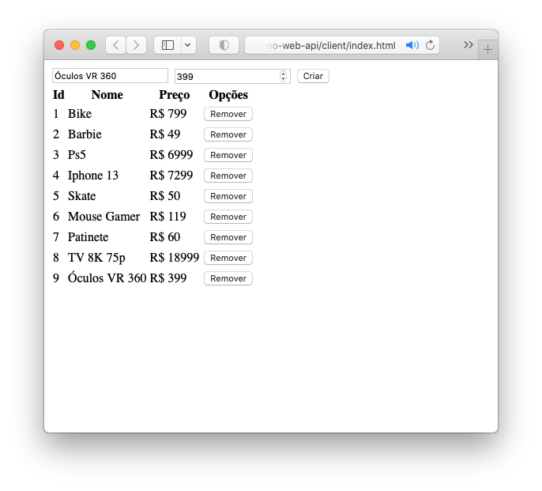

### Deno

O Deno é um ambiente de execução para JavaScript e TypeScript
baseado no mecanismo JavaScript V8 e na linguagem de programação Rust.
Módulos ou pacotes podem ser inclusos a partir de uma URL, isso é CDN (Content Delivery Network),
portanto, com Deno não se usa "package.json" nem "npm install".

#### Web API simples com Deno para gerenciar nome e preço de produtos, para o consumo da api REST: utilizamos o Framework OAK, o mecanismo CORS e manipulação de Arrays

#### Conheça OAK em https://deno.land/x/oak@v10.5.1
